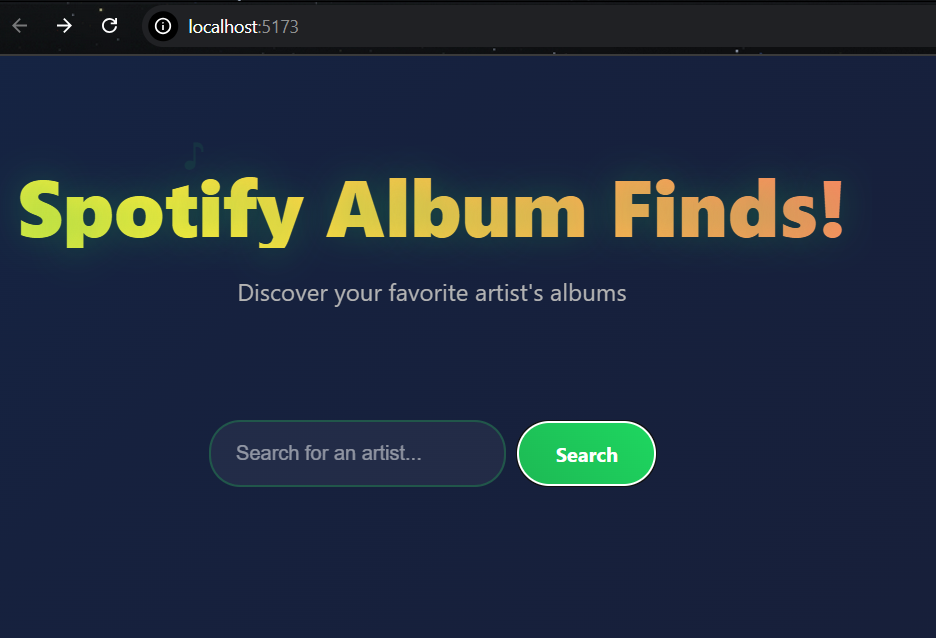
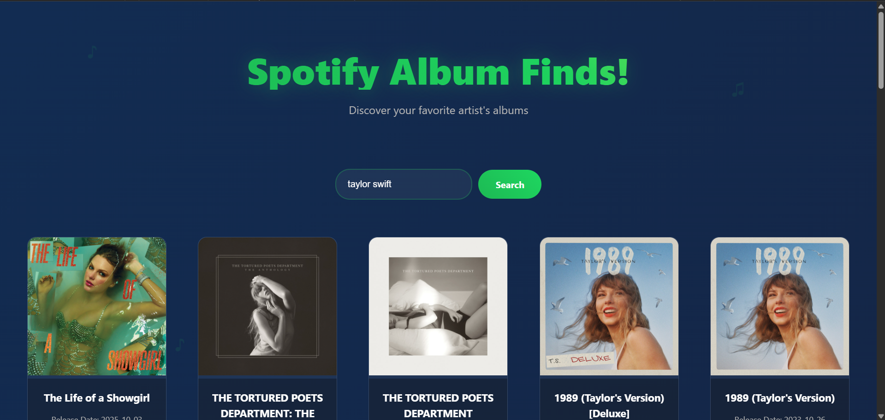

# 🎵 Spotify Album Finder

<div align="center">



**Discover your favorite artist's albums** ✨



</div>

---

## 🌟 Features

- 🔍 **Smart Search** - Find any artist instantly using Spotify's powerful API
- 🎨 **Stunning UI** - Glassmorphism design with smooth animations
- ⚡ **Lightning Fast** - Built with Vite for optimal performance
- 🎭 **Dynamic Animations** - Floating music notes, gradient shifts, and card stagger effects
- 📱 **Fully Responsive** - Works seamlessly on all devices
- 🌈 **Vibrant Gradients** - Eye-catching color schemes that pop
- 🔄 **Loading States** - Beautiful vinyl spinner while fetching data
- 🎯 **Direct Links** - One-click access to albums on Spotify

---

## 🎬 Demo


---

## 🚀 Getting Started

### Prerequisites

- Node.js (v14 or higher)
- npm or yarn
- Spotify Developer Account

### Installation

1. **Clone the repository**
   ```bash
   git clone https://github.com/aditiashok55/spotify-album-finder.git
   cd spotify-album-finder
   ```

2. **Install dependencies**
   ```bash
   npm install
   ```

3. **Set up Spotify API credentials**
   
   - Go to [Spotify Developer Dashboard](https://developer.spotify.com/dashboard)
   - Create a new app
   - Copy your `Client ID` and `Client Secret`
   
4. **Create a `.env` file in the root directory**
   ```env
   VITE_CLIENT_ID=your_client_id_here
   VITE_CLIENT_SECRET=your_client_secret_here
   ```

5. **Run the development server**
   ```bash
   npm run dev
   ```

6. **Open your browser**
   ```
   http://localhost:5173
   ```

---

## 🛠️ Built With

- **[React](https://reactjs.org/)** - JavaScript library for building user interfaces
- **[Vite](https://vitejs.dev/)** - Next generation frontend tooling
- **[React Bootstrap](https://react-bootstrap.github.io/)** - UI component library
- **[Spotify Web API](https://developer.spotify.com/documentation/web-api)** - Access to Spotify's music catalog
- **CSS3 Animations** - Custom keyframe animations for smooth interactions

---

## 🎨 Features Breakdown

### Animated Background
```css
/* Gradient shift animation creates a dynamic, living background */
background: linear-gradient(-45deg, #000000, #1a1a1a, #0a0a0a, #1f1f1f);
animation: gradientShift 15s ease infinite;
```

### Glassmorphism Cards
- Frosted glass effect with backdrop blur
- Subtle transparency for modern aesthetics
- Smooth hover transformations

### Stagger Animations
- Cards appear sequentially with delays
- Creates a professional, polished feel
- Smooth entrance from bottom with scale

### Interactive Elements
- Glowing search bar on focus
- Pulsing button animations
- Vinyl spinner loading state
- Floating music note decorations

---

## 📂 Project Structure

```
spotify-album-finder/
├── src/
│   ├── App.jsx           # Main application component
│   ├── App.css           # Styles and animations
│   ├── main.jsx          # Application entry point
│   └── assets/           # Static assets
├── public/               # Public assets
├── .env                  # Environment variables (not committed)
├── .gitignore           # Git ignore file
├── package.json         # Dependencies and scripts
├── vite.config.js       # Vite configuration
└── README.md            # You are here!
```

---

## 🎯 Usage

1. **Search for an Artist**
   - Type the artist's name in the search bar
   - Press Enter or click the Search button

2. **Browse Albums**
   - Scroll through the artist's discography
   - Hover over cards for interactive effects

3. **Open in Spotify**
   - Click "Open in Spotify" to listen
   - Opens directly in Spotify app or web player

---

## Color Palette

| Color | Hex | Usage |
|-------|-----|-------|
| Spotify Green | `#1DB954` | Primary buttons, accents |
| Light Green | `#1ed760` | Hover states, gradients |
| Dark Background | `#000000` | Base background |
| Glass Effect | `rgba(255, 255, 255, 0.05)` | Card backgrounds |

---

## 🤝 Contributing

Contributions are what make the open-source community amazing! Any contributions you make are **greatly appreciated**.

1. Fork the Project
2. Create your Feature Branch (`git checkout -b feature/AmazingFeature`)
3. Commit your Changes (`git commit -m 'Add some AmazingFeature'`)
4. Push to the Branch (`git push origin feature/AmazingFeature`)
5. Open a Pull Request

---

## Credits & Acknowledgments

- **Original Tutorial**: This project is based on the [Codédex Spotify API Tutorial](https://www.codedex.io/projects/build-an-album-finder-with-spotify-api)
- **Codédex Team**: For providing the baseline template and excellent learning resources
- **Spotify**: For their amazing Web API
- **React Bootstrap**: For the component library
- **Design Inspiration**: Modern web design trends and glassmorphism aesthetics

---

## ⭐ Show Your Support

If you found this project helpful, please give it a ⭐️!

---

<div align="center">

**Made with ❤️ and ☕**

Built with the power of React, Spotify API, and lots of CSS animations!

</div>